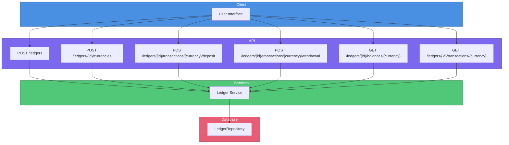
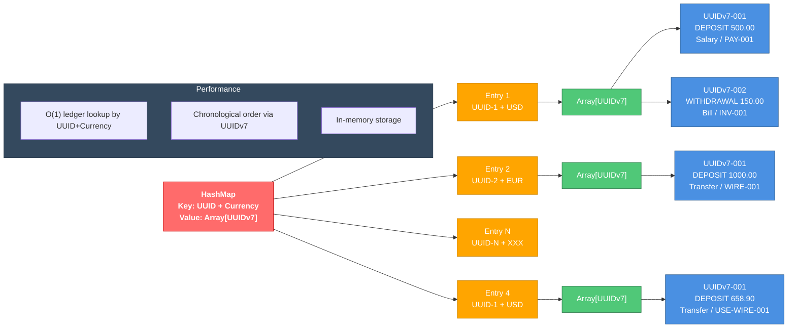

# Ledger API Documentation

This document describes the Ledger API as part of the Tiny Ledger project, which
provides endpoints for managing user ledgers, including creating ledgers, depositing
and withdrawing funds, checking balances, and viewing transaction history.

# API

This resource allows the system perform the following operations:

- Create a new ledger.
- Retrieve the current balance of the account.
- Deposit funds into the ledger.
- Withdraw funds from the ledger.
- Retrieve the transaction history for the ledger.

> [!NOTE]
> Initially I was planning to have an Account API and a Ledger API. However,
> I decided to not do it and simplify the implementation and focus on concepts.
> I was running out of time.

## How to Use

### Running the API

Makefile with different targets exists: :

- **Development mode (JVM)**: `make dev`
- **JVM flavour**: `make run-jvm`
- **Native flavour**: `make run-native`

### Testing

- Run tests: `make test`
- Test the API with the provided script: `./scripts/test.sh`

### Build Targets

- run `make` and the default target will show the available targets.

## Assumptions

- No customised page errors for Quarkus. Any jakarta validation errors will be
  returned as is.
- Negative balances are allowed.
- Allowed only two type of operations with the ledger, DEPOSIT and WITHDRAWAL.
- The balance endpoint returns the current balance doing a reduce operation across
all transactions. This clearly would not scale for a production, but for the
exercise simplifies the implementation of the storage.
- History period is hardcoded to current day.

### Storage

Storage will be an in-memory data structure for simplicity as requested.

Basically the storage is a ```ConcurrentHashMap<LedgerKey, ConcurrentSkipListMap<UUID, Transaction>>```
where UUID is a UUIDv7 to ensure chronological order of transactions.

### Authentication and Authorization

Not implemented as requested in the guidelines.

It could be implemented with Apache Keycloak, Vault or other system.

### Observability

Logging is basic and monitoring are not included, as requested in the guidelines

Following OpenTelemetry standards and instrumenting the code with tracing and metrics
would be the recommended approach for production systems.

### CDC

- No events. This is important as the correct way to implement the history should
be send events to an event bus and allow to keep the CDC in a more appropriate storage
to ensure longer retention and not bloat the operational database.

### Other considerations

- Error handling is basic and may need to be expanded for production use.

# Architecture



# Storage Schema


